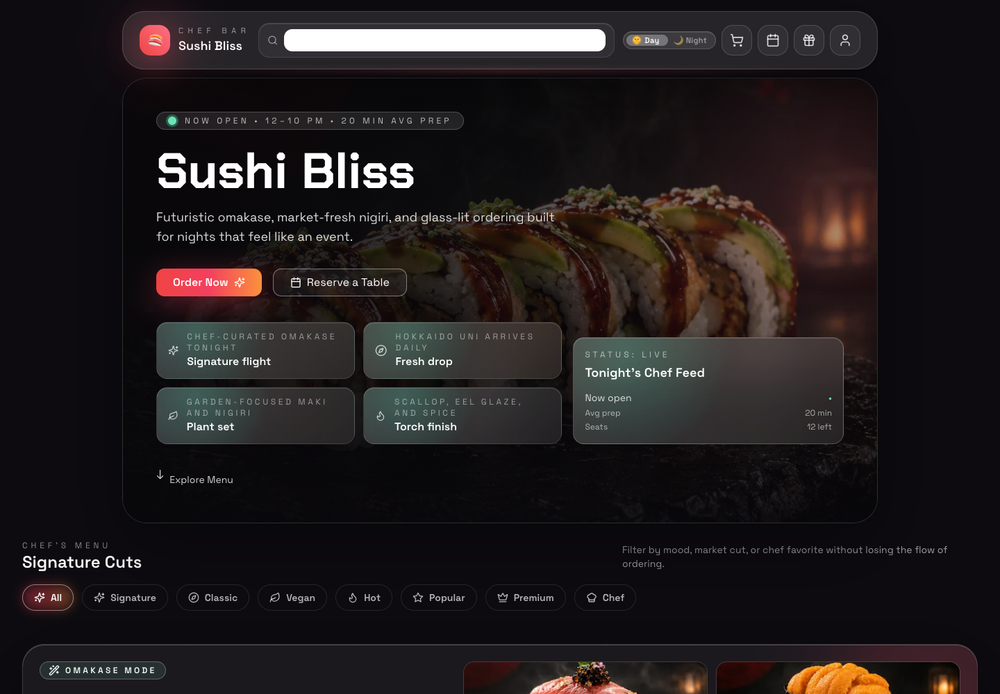
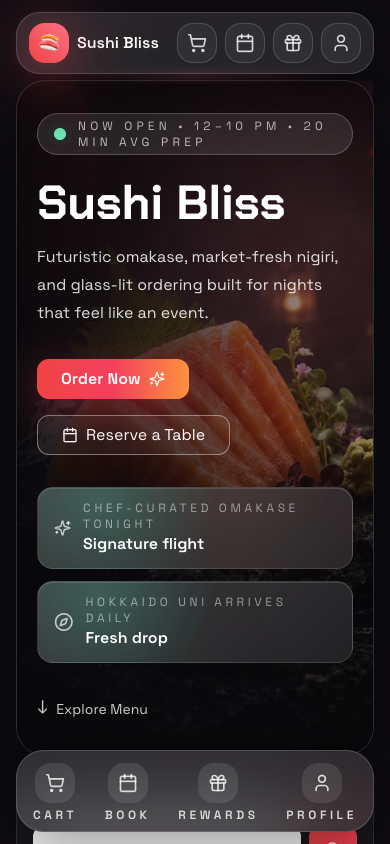

# Sushi Bliss

A futuristic, mobile-first sushi ordering experience built with Next.js, Tailwind CSS, and Framer Motion. The app includes menu filtering, animated cart interactions, loyalty rewards, reservations, and a payment flow.

## Screenshots

| Desktop | Mobile |
| --- | --- |
|  |  |

## Features

- Responsive UI (mobile, tablet, desktop)
- Animated hero, menu cards, and cart interactions
- Menu search and category filters
- Cart totals with promo codes and tips
- Loyalty points + reward redemption
- Reservations and profile management

## Tech Stack

- Next.js 14 (App Router)
- React 18
- Tailwind CSS
- Framer Motion
- Vitest + Testing Library
- Playwright (E2E)

## Getting Started

```bash
npm install
npm run dev
```

Open http://localhost:3000 in your browser.

## Scripts

```bash
npm run dev        # Start development server
npm run build      # Production build
npm run start      # Start production server
npm run test       # Unit tests (custom runner)
npm run test:e2e   # Playwright E2E tests
```

## Project Structure

- `src/app` - App Router pages, layout, and global styles
- `src/components` - UI and feature components
- `src/data` - Menu data
- `src/lib` - Utility logic (cart totals, filtering)
- `tests` - Playwright E2E specs

## Notes

- Fonts are bundled locally under `src/app/fonts`.
- Images are stored in `public/sushi`.

## License

MIT
